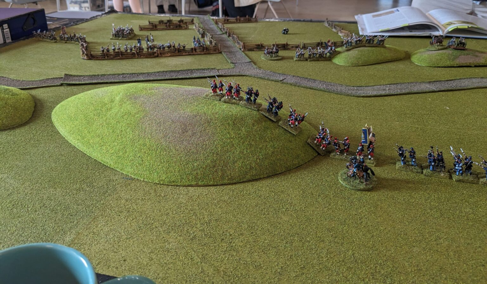
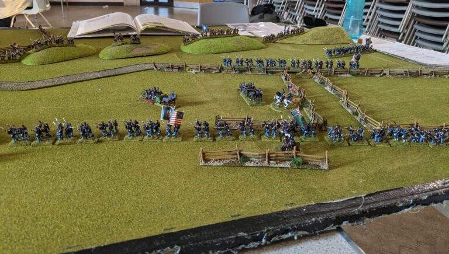
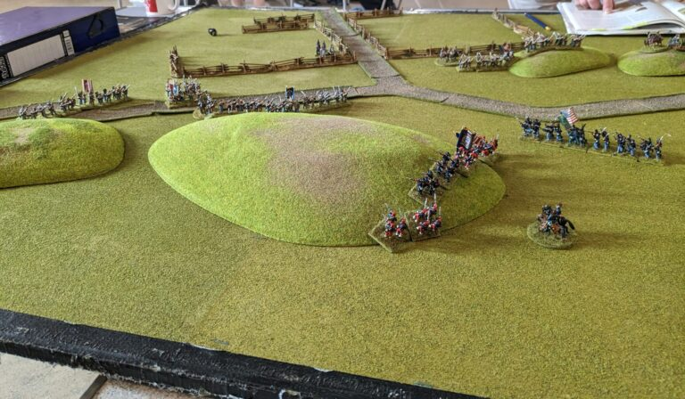
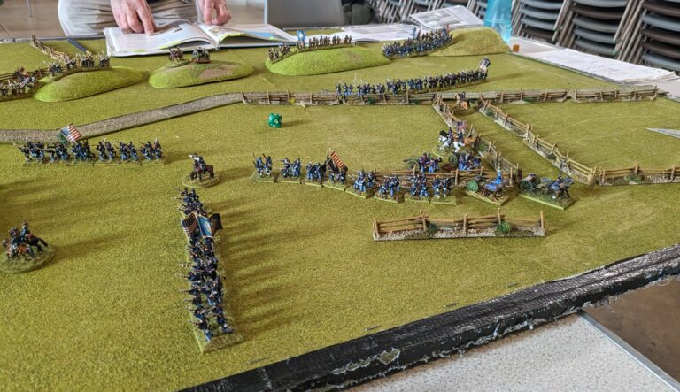
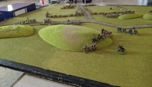
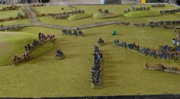
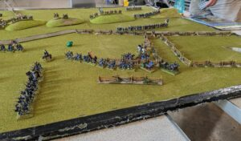

I played a game of [Fire and Fury](https://www.fireandfury.com/fireandfurymain.shtml) on Sunday. This is a fairly short battle report for the game. Unfortunately, due to an excess of chit chat we failed to finish the game. This was my third American Civil War battle using the Fire and Fury rules and I find the rules to be very good.

## Game Set Up

The above image is the game as we'd set the game up. We were short of time so we deployed straight to the locations we would have occupied anyway. The game board is a confluence of a couple of valleys with a small road junction. The Union force is heading down the road to the junction with a parallel column to the right. The Confederates lined up along the hill parallel to the road as well as lining the field next to the road junction.

I was the Union side and my playing partner John was playing the Confederates.

## Second Turn

I managed to get the brigades on the Union right flank into line and moved the far right brigade close the Confederate brigade on their left flank occupying a hill next to the road.

My great failing as an American Civil War general is that I always deploy to line far too late. This makes my brigades a huge target for Confederate artillery.

## Turn Three

The Union moved the brigade into close quarters preparing for an assault on the Confederate left flank.

## Turn Four

The Union won the close assault on their right flank forcing the Confederate to retreat 8" from the hill top. This placed the brigade on the next hill something of a problem as they had a large green Union brigade to their front and a small veteran brigade threatening their flank.

## Conclusion
It was a pity we didn't have more time as things were going to be close. If the Union could clear the hills running parallel to the road, things would have been problematic for the Confederates.

The Union plan was sound, it was just messed up by my poor maneuvering.